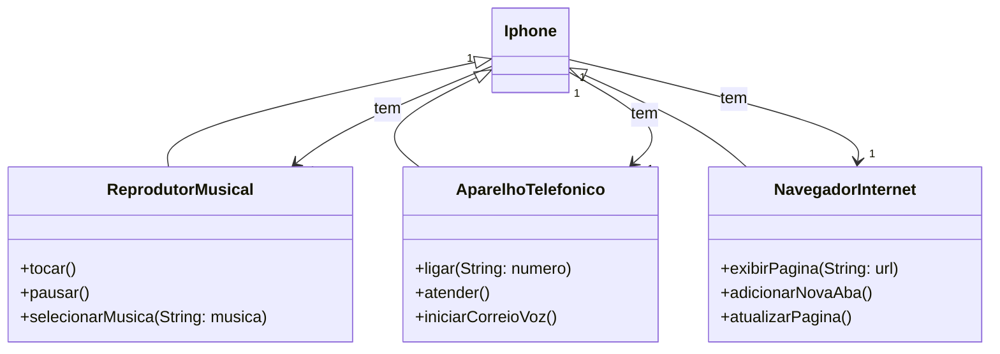

```mermaid
classDiagram
      Iphone <|-- ReprodutorMusical
      Iphone <|-- AparelhoTelefonico
      Iphone <|-- NavegadorInternet

class ReprodutorMusical {
      +tocar()
      +pausar()
      +selecionarMusica(String: musica)
}
    
class AparelhoTelefonico {
  +ligar(String: numero)
  +atender()
  +iniciarCorreioVoz()
}
    
class NavegadorInternet {
  +exibirPagina(String: url)
  +adicionarNovaAba()
  +atualizarPagina()
}

Iphone "1" --> "1" ReprodutorMusical : tem
Iphone "1" --> "1" AparelhoTelefonico : tem
Iphone "1" --> "1" NavegadorInternet : tem

```

Projeto de classes DIO.